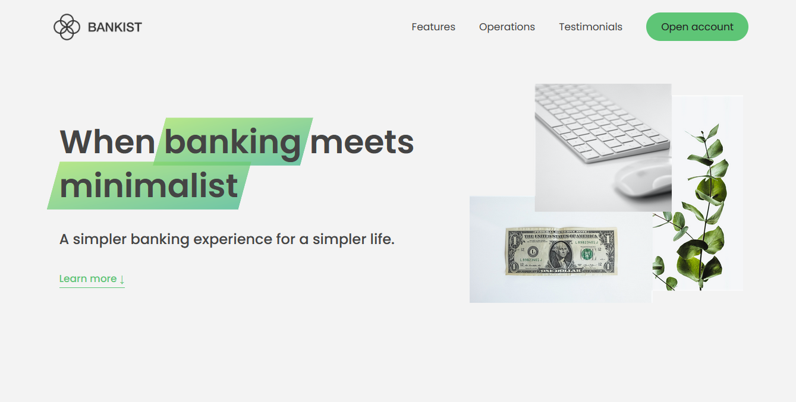

> _Bankist_ is a new modern of save your cryto coins without any worries

# 🐱‍🏍 Bankist Landing Page

Greetings! Fellow Developer 💥, Bankist is a new modern era of draw some money with cryptocurrency ⚖.
this project was inspired by one of the crypto bank landing page but I build it with a new concept
and more slightly modern.

This project also to boost my Front-End Development Skillset.
for those who just got into programming particularly JavaScript you can use this code as your learning reference
because this code base contain Advanced DOM manipulation likewise DOM animation with
pure Vanilla JavaScript.

## Run Locally

Clone the project

```bash
  git clone https://github.com/zourdycodes/bankist-frontend.gits
```

Go to the project directory

```bash
  cd my-project
```

Install dependencies

```bash
  npm install
```

Start the server

```bash
  npm run start
```

## Screenshot Project

<center></center>

## Tech Stack

🚀**Client:** HTML5, CSS3, SASS, JAVASCRIPT

🚀**Server:** Node, Gunicorn

## Contributing

Contributions are always welcome!

See `contributing.md` for ways to get started.

Please adhere to this project's `code of conduct`.

## Authors

[zourdycodes](https://zourdycodes.netlify.app/)
